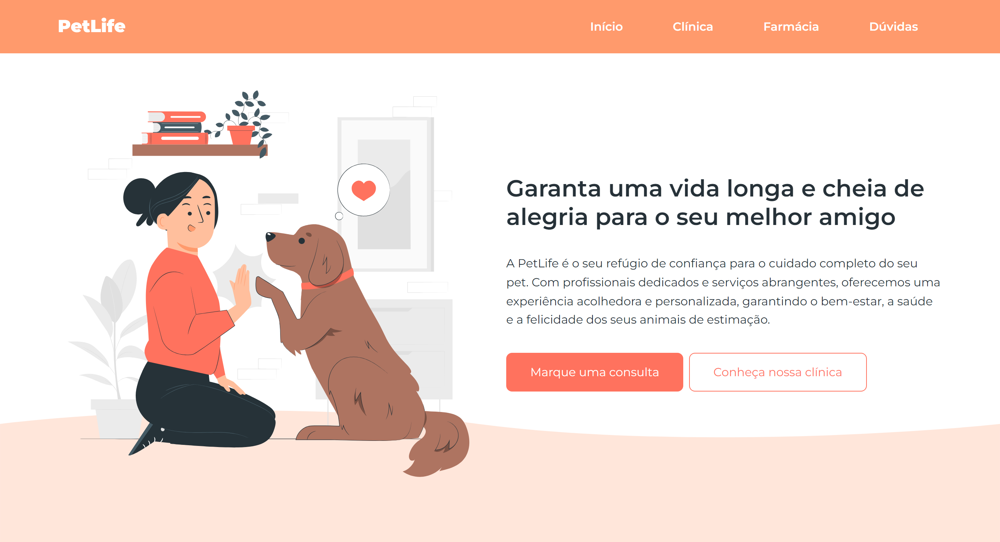

# We Care

Projeto simples para treinar HTML, CSS e Javascript.

[Projeto online](https://barbaraishioka.github.io/onebitcode/pet-life)



## Tecnologias

- HTML
- CSS
- Javascript

## Instalação

```bash
git clone https://github.com/barbaraishioka/onebitcode/pet-life.git

cd onebitcode/pet-life
```

## Licença

Este projeto está licenciado sob os termos da Licença MIT.
