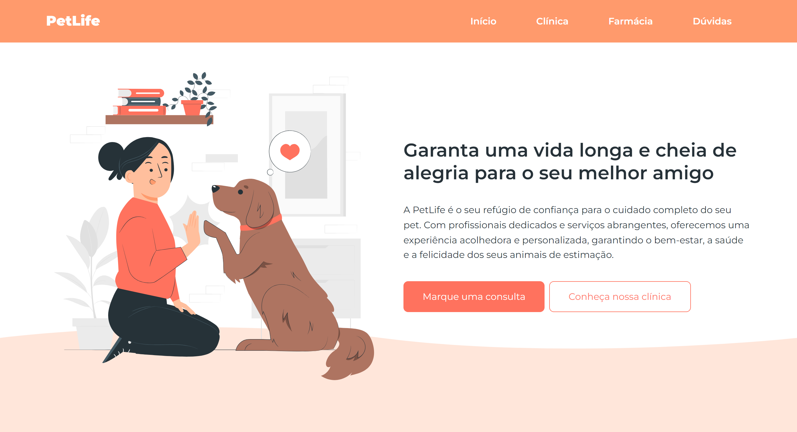

<h1>Projetos OneBitCode</h1>

  

    Projetos desenvolvidos durante o curso da plataforma <a href="https://www.onebitcode.com/">OneBitCode</a>.
  

   

  <table>
    <thead>
      <tr>
        <th align="center">#</th>
        <th align="center">Projeto</th>
        <th align="center">Tecnologias</th>
        <th align="center">Online</th>
      </tr>
    </thead>
    <tbody>
      <tr>
        <td>01</td>
        <td align="center"><a href="./pet-life/readme.md">PetLife</a></td>
        <td width="160px">HTML - CSS - Javascript</td>
        <td align="center">
          
        </td>
      </tr>
    </tbody>

  </table>

   
